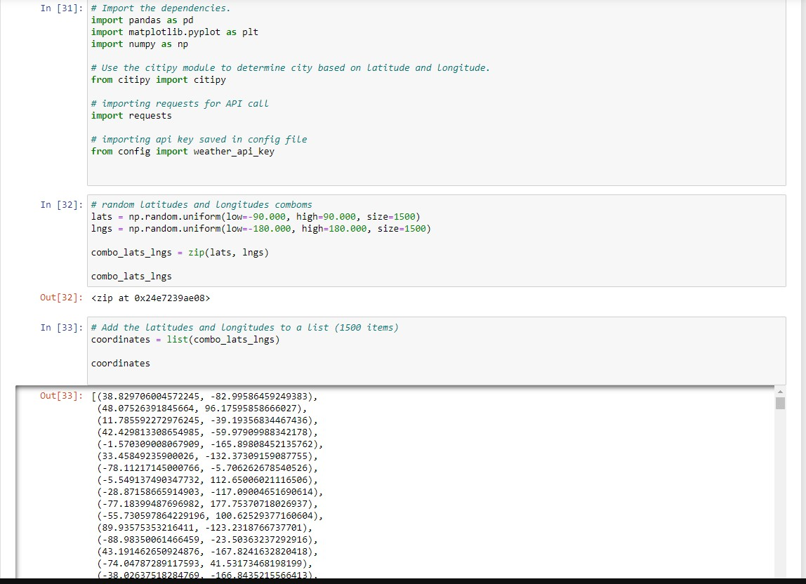
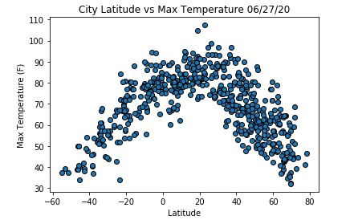
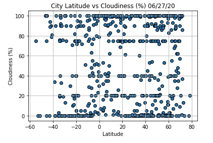
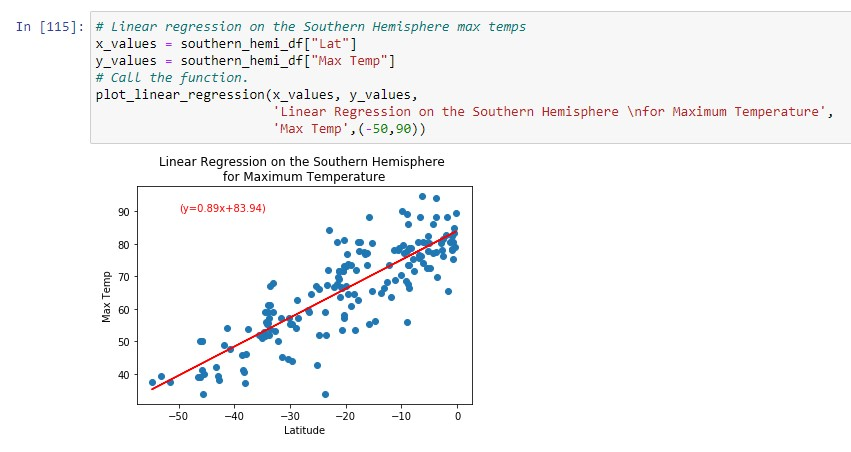
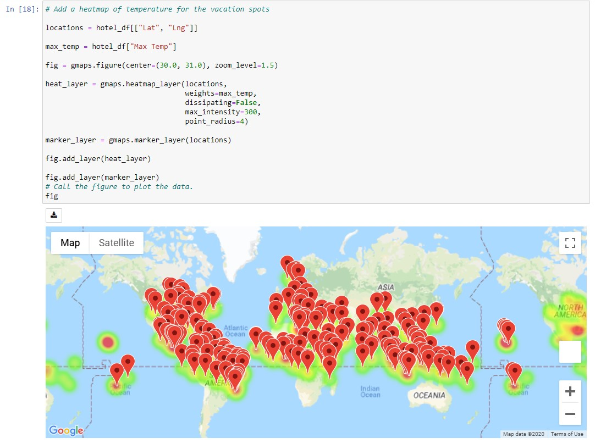

# World_Weather_Analysis
Provide filtered data for travel company customers to search hotels and weather patterns in those hotels' cities to book travel plans.

To seek a vacation, one must make advanced plans to successfully book themselves in a place of leisure and free of worries. This project aims to aide a travel company’s request to add filterable data for customers looking for hotels around the world. It also includes weather data to equip a customer with feasibility and planning when going to a hotspot destination. 

Some of the programs used for this project:
- Python Pandas
- Google Maps API get and Open Weather API requests 
- Matplotlib

The tasks for this project were to perform cleaning and transformation of data weather data using Python Pandas and API. Other tasks were:

- Retrieve and store values from API request JSON array and use ```try``` and ```except``` to arising conflicts with requesting data
- Use citipy library to attach cities to the randomly generated 500 coordinates
- Create Python functions with various Matplotlib plots such as scatter, bar plots, and heatmaps
- Analyze weather patterns using simple linear regression analysis

## Jupyter Notebook

First, a simple task was to generate 500+ random coordinates using NumPy library. I had to validate those coordinates by finding real cities as close to those randomly generated coordinates. Then, it was using Open Weather API to request weather data for all those cities (city names had to attributed first) and clean those DataFrame to convert to a readable CSV. 


The next step was to make initial analysis of the requested data to check the validity. An easy method was to plot all the coordinates and constrain the graph to a certain attribute of the weather data, like temperature, cloudiness. This reduces the chance of outlier cities within our dataset and checks whether the graphs match frontal map projections of a Mercator map.

### Temperature 


### Cloudiness


I used linear regression analysis to verify the projection of those weather attributes such as temperature in a hemisphere.

### Linera Regression


Lastly, I came up with a method to use a customer's preference of minimum and maximum temperature of comfort to filter those cities and mark all the hotels within those cities using Google Maps API. 


